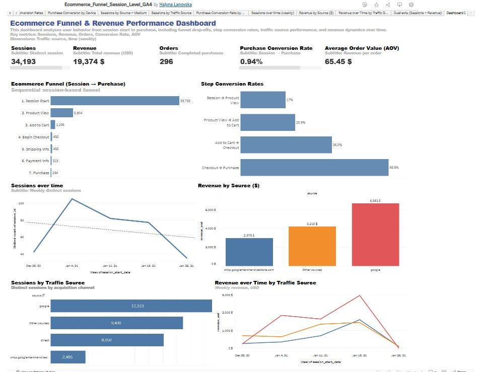

# Ecommerce Funnel Session-Level Analysis (GA4 + Tableau)
Session-level ecommerce funnel analysis using GA4 data with Tableau dashboard

## 📊 Dashboard Preview

  

## 📊 Interactive Dashboard

👉 [View Tableau Dashboard](https://public.tableau.com/views/Ecommerce_Funnel_Session_Level_GA4/Dashboard1)

## 🎯 Project Overview

This project analyzes user behavior across the ecommerce funnel using session-level GA4 data to identify conversion bottlenecks and optimize performance.

## 🎯 Business Goal

- Analyze user journey across funnel stages
- Identify conversion bottlenecks
- Improve conversion rate

## 🧰 Tools Used

- Tableau
- GA4 dataset

## 📈 Key Metrics

- Sessions
- Orders
- Revenue
- Conversion rate
- Average order value (AOV)

## 🔍 Analysis

The funnel includes:

- session_start
- view_item
- add_to_cart
- begin_checkout
- purchase

## 💡 Key Insights

- The largest drop-off occurs between product view and add_to_cart
- Checkout stage shows relatively high conversion rate
- Revenue is highly dependent on traffic source

## 🚀 Business Impact

- Identified key drop-off stages in the funnel
- Provided insights to improve product engagement
- Highlighted revenue-driving traffic sources
